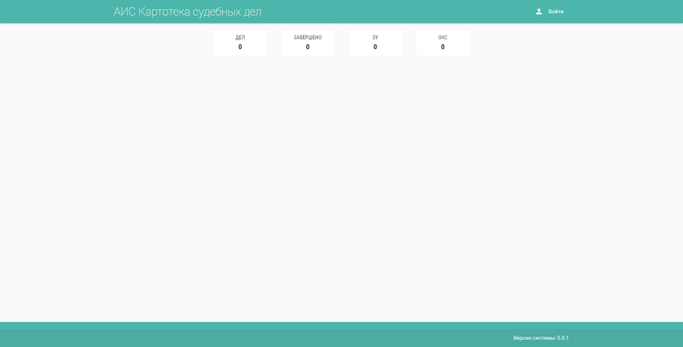

# Веб-приложение: учетно-справочная система для хранения судебных дел

Приложение предназначено для учета судебных дел, документов и событий. Поддерживается поиск по номеру дела, дате, краткому описанию дела.

## Установка

Скачиваем проект с github:
```
git clone https://github.com/holopov/is_cc.git
```

Создаем виртуальное окружение, активируем его и устанавливаем зависимости:
```
pip install -r requirements.txt
```

Инициализируем пользователя с правами администратора. Запускаем скрипт:
```
python create_admin.py
```

Запускаем веб-сервер, для windows:
```
set FLASK_APP=webapp && set FLASK_ENV=development && set FLASK_DEBUG=1 && flask run
```

для linux:
```
export FLASK_APP=webapp && export FLASK_ENV=development && flask run
```

Открываем браузер и в адресной строке вводим http://127.0.0.1:5000/

Если все получилось, то откроется стартовая страница приложения


